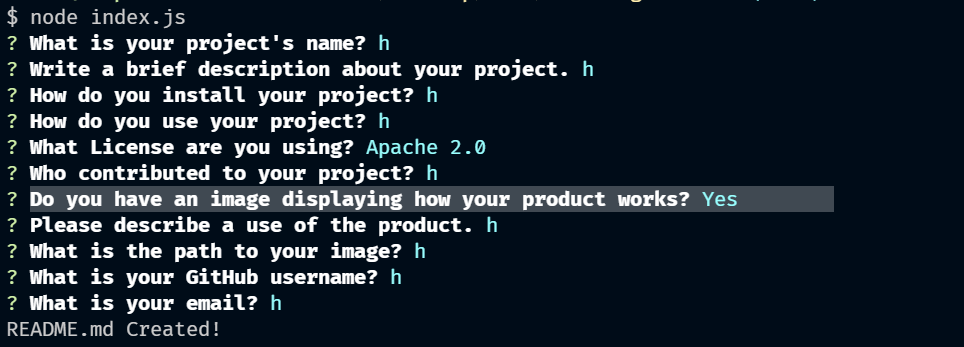
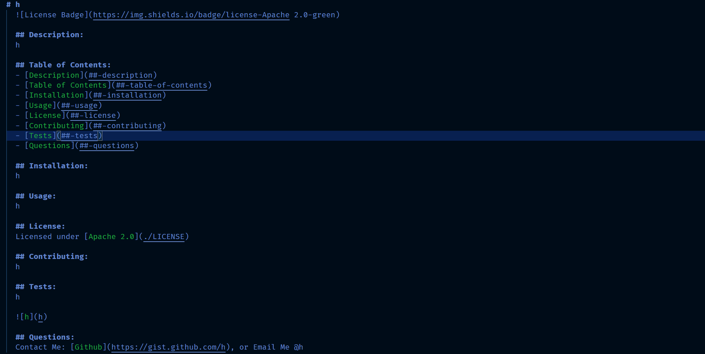
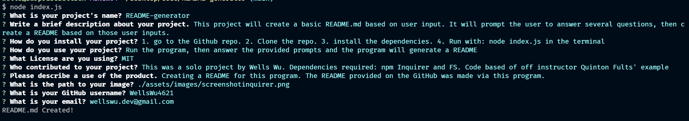

# README-generator  
  
  [IMPORTANT](https://www.youtube.com/watch?v=dQw4w9WgXcQ)
  
  ## Description:  
  This project will create a basic README.md based on user input. It will prompt the user to answer several questions, then create a README based on those user inputs. 

  ## Table of Contents:  
  - [Description](#-description)
  - [Table of Contents](#-table-of-contents)
  - [Installation](#-installation)
  - [Usage](#-usage)
  - [License](#-license)
  - [Contributing](#-contributing)
  - [Tests](#-tests)
  - [Questions](#-questions)

  ## Installation:  
  1. go to the Github repo. 2. Clone the repo. 3. install the dependencies. 4. Run with: node index.js in the terminal

  ## Usage:  
  Run the program, then answer the provided prompts and the program will generate a README

  
  
  
  ## License:  
  Licensed under [MIT](./LICENSE)
  
  ## Contributing:  
  This was a solo project by Wells Wu. Dependencies required: npm Inquirer and FS, and path. Code based of off instructor Quinton Fults' example
  
  ## Tests:  
  Creating a README for this program. The README provided on the GitHub was made via this program.

    
  
  
  ## Questions:  
  Contact Me: [Github](https://gist.github.com/WellsWu4621), or Email Me @wellswu.dev@gmail.com  
  Repository link: [README-generator](https://github.com/WellsWu4621/README-generator)

